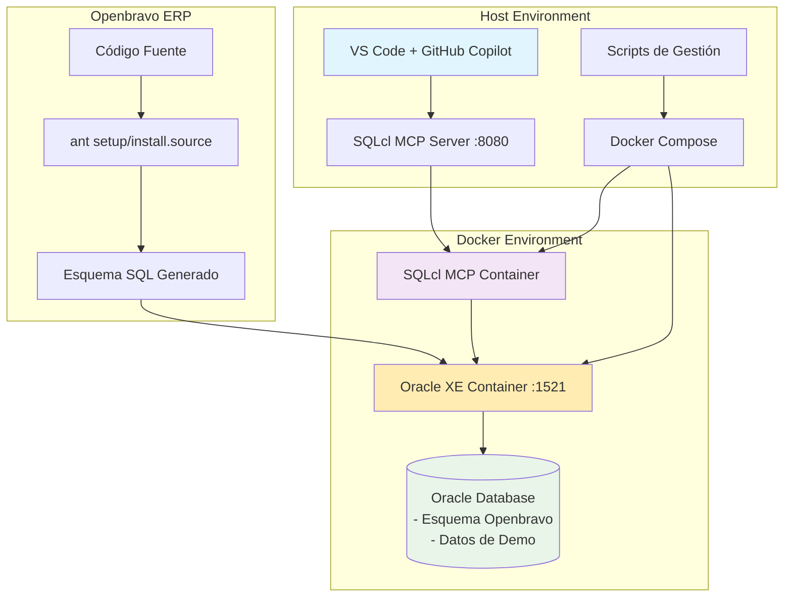

# Entorno de Tests: Openbravo ERP + PostgreSQL + MCP Server

> 🚀 **Entorno de desarrollo y tests** que integra Openbravo ERP con PostgreSQL y servidor MCP para interacción con agentes de IA como GitHub Copilot.

[](https://www.docker.com/)
[](https://www.postgresql.org/) 
[](https://github.com/modelcontextprotocol)
[](https://github.com/features/copilot)

## 📋 Tabla de Contenidos

- [Descripción](#-descripción)
- [Características](#-características) 
- [Arquitectura](#-arquitectura)
- [Requisitos Previos](#-requisitos-previos)
- [Instalación Rápida](#-instalación-rápida)
- [Instalación Detallada](#-instalación-detallada)
- [Verificación](#-verificación)
- [Uso con GitHub Copilot](#-uso-con-github-copilot)
- [Scripts Disponibles](#-scripts-disponibles)
- [Tareas de VS Code](#-tareas-de-vs-code)
- [Solución de Problemas](#-solución-de-problemas)
- [Casos de Uso](#-casos-de-uso)
- [Mantenimiento](#-mantenimiento)
- [Contribuir](#-contribuir)

## 🎯 Descripción

Este proyecto proporciona un **entorno completo, reproducible y containerizado** que combina:

- **🏢 Openbravo ERP**: Sistema ERP open source con funcionalidades completas de gestión empresarial
- **� PostgreSQL**: Base de datos PostgreSQL para almacenamiento de datos (más compatible con Openbravo que Oracle)
- **🔧 MCP Server**: Servidor MCP (Model Context Protocol) que expone herramientas de base de datos para agentes de IA
- **🤖 GitHub Copilot**: Integración ready-to-use para agentes de codificación automatizados

El objetivo es permitir que **agentes de IA** (como GitHub Copilot en modo agente) puedan interactuar de forma natural con una base de datos ERP real usando lenguaje natural.

> ⚠️ **Importante**: Se ha migrado de Oracle a PostgreSQL debido a mejor compatibilidad y rendimiento con Openbravo ERP.

## ✨ Características

### 🚀 **Setup Automatizado**
- Un comando para levantar todo el entorno
- Scripts de configuración y verificación incluidos  
- Datos de prueba precargados

### 🐳 **Totalmente Containerizado**
- PostgreSQL 15 en Docker (sin instalación local)
- MCP Server en contenedor dedicado
- Networking automático entre servicios
- Volúmenes persistentes para datos

### 🤖 **GitHub Copilot Ready**
- Servidor MCP expuesto y configurado
- Herramientas SQL disponibles para agentes
- Instrucciones específicas en `.github/copilot-instructions.md`
- Casos de uso documentados

### 🛠️ **Herramientas de Desarrollo**
- Tareas de VS Code preconfiguradas
- DevContainer support
- Scripts de mantenimiento
- Logging y monitoreo

### 📊 **Datos de Demo**
- Esquema Openbravo básico precargado
- Clientes, productos y organizaciones de ejemplo
- Datos listos para consultas y análisis

## 🏗️ Arquitectura



## 📋 Requisitos Previos

### Software Requerido

- **Docker** >= 20.10 y **Docker Compose** >= 2.0
- **Java JDK** >= 8 (para compilar Openbravo)  
- **Apache Ant** >= 1.9 (para build de Openbravo)
- **Git** (para clonar repositorios)

### Software Opcional (Recomendado)

- **Oracle Instant Client + SQLPlus** (para conexión directa)
- **VS Code** con extensiones:
  - GitHub Copilot
  - Oracle Developer Tools  
  - SQL Database Projects
- **curl** (para verificaciones HTTP)

### Recursos de Sistema

- **RAM**: Mínimo 8GB, recomendado 16GB
- **Disco**: Mínimo 10GB libres para imágenes y datos
- **CPU**: Mínimo 2 cores, recomendado 4+ cores

### Verificación de Requisitos

```bash
# Verificar Docker
docker --version && docker compose version

# Verificar Java y Ant  
java -version && ant -version

# Verificar Git
git --version

# Verificar recursos
docker system info | grep -E "Total Memory|CPUs"
```

## ⚡ Instalación Rápida

> **⏱️ Tiempo estimado:** 10-20 minutos (dependiendo de la velocidad de descarga)
> **🐘 PostgreSQL:** Más rápido y compatible que Oracle para Openbravo ERP

### Opción 1: Script Automatizado PostgreSQL (Altamente Recomendado)

```bash
# 1. Clonar el repositorio
git clone https://github.com/DaGarJim/openbravo-erp.git
cd openbravo-erp

# 2. Ejecutar setup completo para PostgreSQL  
./setup-postgres.sh
```

### Opción 2: VS Code Tasks (PostgreSQL)

```bash
# 1. Clonar y abrir en VS Code
git clone https://github.com/DaGarJim/openbravo-erp.git
cd openbravo-erp
code .

# 2. Setup PostgreSQL desde VS Code
# Cmd+Shift+P → "Tasks: Run Task" → "� Setup PostgreSQL (Recomendado)"
```

### Opción 3: Manual (PostgreSQL)

```bash
# 1. Clonar el repositorio
git clone https://github.com/DaGarJim/openbravo-erp.git
cd openbravo-erp

# 2. Compilar Openbravo (opcional para demo básico)
ant setup
ant install.source

# 3. Levantar entorno Docker PostgreSQL
docker compose up -d

# 4. Cargar esquema y datos
./scripts/01_load_openbravo_postgres.sh

# 5. Verificar instalación
./scripts/02_verify_environment_postgres.sh
```

### ⚠️ Migración de Oracle a PostgreSQL

Si habías usado anteriormente la versión con Oracle, limpia el entorno:

```bash
# Limpiar entorno Oracle anterior
./scripts/03_reset_environment.sh --full  # Si existe
docker volume prune -f
docker system prune -f

# Proceder con setup PostgreSQL
./setup-postgres.sh

# 4. Cargar esquema en Oracle
./scripts/01_load_openbravo.sh

# 5. Verificar entorno
./scripts/02_verify_environment.sh
```

Si todo va bien, deberías ver:
```
✅ TODOS LOS CHECKS PASARON (6/6)
🎉 El entorno está listo para usar con GitHub Copilot Agents.
```

## 🔧 Instalación Detallada

<details>
<summary>👆 Click para expandir la guía paso a paso</summary>

### Paso 1: Preparar el entorno de desarrollo

```bash
# Crear directorio de trabajo
mkdir -p ~/dev/openbravo-demo
cd ~/dev/openbravo-demo

# Clonar el repositorio
git clone https://github.com/DaGarJim/openbravo-erp.git
cd openbravo-erp

# Verificar estructura del proyecto
ls -la
```

### Paso 2: Compilar Openbravo ERP

```bash
# Configuración inicial de Openbravo
ant setup

# El comando anterior creará archivos de configuración base.
# Revisa el archivo config/Openbravo.properties.template para entender la configuración.

# Generar código fuente y esquema SQL
ant install.source

# Verificar que se generaron los archivos SQL
ls -la src-db/database/
```

### Paso 3: Configurar Oracle XE

```bash
# Verificar la configuración de Docker Compose
cat docker-compose.yml

# Descargar imagen de Oracle XE (puede tardar varios minutos)
docker pull container-registry.oracle.com/database/express:latest

# Iniciar Oracle XE
docker compose up -d oracle-xe

# Verificar que Oracle está iniciando (puede tardar 2-5 minutos)
docker logs -f openbravo-oracle-xe
```

### Paso 4: Construir imagen SQLcl MCP

```bash
# Construir imagen SQLcl MCP
docker compose build sqlcl-mcp

# Iniciar el servicio SQLcl MCP
docker compose up -d sqlcl-mcp

# Verificar logs
docker logs -f openbravo-sqlcl-mcp
```

### Paso 5: Cargar esquema Openbravo

```bash
# Ejecutar script de carga
./scripts/01_load_openbravo.sh

# El script hará:
# - Crear usuario 'openbravo' en Oracle
# - Cargar esquema básico con tablas principales
# - Insertar datos de ejemplo
# - Configurar triggers de auditoría
```

### Paso 6: Verificar instalación

```bash
# Ejecutar verificaciones completas  
./scripts/02_verify_environment.sh

# Conectar manualmente para probar
sqlplus openbravo/ob_pwd@//localhost:1521/XEPDB1
```

</details>

## ✅ Verificación

Después de la instalación, ejecuta:

```bash
./scripts/02_verify_environment.sh
```

**Resultado esperado:**
```
✅ Docker está ejecutándose correctamente.
✅ Contenedor Oracle XE está ejecutándose.
✅ Contenedor SQLcl MCP está ejecutándose.
✅ Conectividad con Oracle XE verificada.
✅ Esquema Openbravo verificado correctamente.
✅ Servidor SQLcl MCP está respondiendo.
✅ Test básico de funcionalidad PASADO.

🎉 TODOS LOS CHECKS PASARON (6/6)
```

### Conexiones de Prueba

```bash
# Conectar a Oracle XE
sqlplus openbravo/ob_pwd@//localhost:1521/XEPDB1

# Probar consulta básica
SELECT COUNT(*) FROM c_bpartner;

# Verificar servidor MCP
curl http://localhost:8080/health
```

## 🤖 Uso con GitHub Copilot

Una vez configurado el entorno, GitHub Copilot puede interactuar con la base de datos usando el servidor MCP.

### Ejemplos de Comandos Naturales

**Consultas:**
- *"Muéstrame los 5 clientes con mayor límite de crédito"*
- *"¿Cuántos productos tenemos en la base de datos?"*
- *"Lista todas las organizaciones activas"*

**Actualizaciones:**
- *"Aumenta el límite de crédito del cliente 'BE-001' a 20000"*
- *"Marca como inactivo el producto con código 'COLA-001'"*

**Análisis:**
- *"¿Cuál es el límite de crédito promedio de nuestros clientes?"*
- *"Muéstrame un resumen de clientes por organización"*

### Configuración de GitHub Copilot

El archivo `.github/copilot-instructions.md` contiene instrucciones específicas para el agente. Los puntos clave:

- 🔗 **Conexión MCP**: `http://localhost:8080`
- 👤 **Usuario Oracle**: `openbravo/ob_pwd@//localhost:1521/XEPDB1`
- 📊 **Tablas principales**: `C_BPARTNER`, `M_PRODUCT`, `AD_CLIENT`, `AD_ORG`
- 📝 **Auditoría**: Cambios registrados en `DBTOOLS_MCP_LOG`

## 📜 Scripts Disponibles

| Script | Descripción | Uso |
|--------|-------------|-----|
| `setup.sh` | **Setup completo automatizado** | `./setup.sh` |
| `01_load_openbravo.sh` | Carga esquema y datos básicos | `./scripts/01_load_openbravo.sh` |
| `02_verify_environment.sh` | Verifica el entorno completo | `./scripts/02_verify_environment.sh` |
| `03_reset_environment.sh` | Reset completo o suave | `./scripts/03_reset_environment.sh --help` |

### Opciones de Reset

```bash
# Reset suave (reinicia contenedores, mantiene datos)
./scripts/03_reset_environment.sh --soft

# Reset completo (⚠️ DESTRUYE TODOS LOS DATOS)  
./scripts/03_reset_environment.sh --full

# Modo interactivo
./scripts/03_reset_environment.sh
```

## 🎯 Tareas de VS Code

Abre el **Command Palette** (`Cmd+Shift+P` en Mac, `Ctrl+Shift+P` en Windows/Linux) y busca **"Tasks: Run Task"**:

### Tareas Principales
- 🚀 **Setup completo del entorno** - Ejecuta todo desde cero
- 🐳 **Levantar entorno Docker** - Solo contenedores
- 📋 **Cargar esquema Openbravo** - Solo carga de datos
- ✅ **Verificar entorno** - Solo verificaciones

### Tareas de Desarrollo  
- 🏗️ **Compilar Openbravo (ant setup)**
- 📦 **Compilar Openbravo (ant install.source)**
- 📊 **Conectar a Oracle XE (sqlplus)**

### Tareas de Mantenimiento
- 🔄 **Reset suave (reiniciar)**
- 🗑️ **Reset completo**
- 🔍 **Ver logs de Oracle XE**
- 🔍 **Ver logs de SQLcl MCP**

## 🚨 Solución de Problemas

<details>
<summary>🐳 Problemas con Docker</summary>

**Error: "Cannot connect to Docker daemon"**
```bash
# Verificar que Docker está ejecutándose
docker info

# En macOS, abrir Docker Desktop
open -a Docker

# En Linux, iniciar servicio
sudo systemctl start docker
```

**Error: "Port 1521 already in use"**
```bash
# Encontrar proceso usando el puerto
lsof -i :1521

# Parar Oracle local si existe
sudo systemctl stop oracle-xe  # Linux
sudo launchctl unload ~/Library/LaunchAgents/com.oracle.* # macOS
```

</details>

<details>
<summary>🗄️ Problemas con Oracle XE</summary>

**Oracle no inicia o no responde**
```bash
# Ver logs detallados
docker logs openbravo-oracle-xe

# Verificar recursos del sistema
docker stats openbravo-oracle-xe

# Reiniciar contenedor
docker restart openbravo-oracle-xe
```

**Error: "ORA-12541: TNS:no listener"**
```bash
# Esperar que Oracle termine de inicializar (puede tardar 5+ minutos)
docker logs -f openbravo-oracle-xe | grep "DATABASE IS READY"

# Verificar puerto
nc -z localhost 1521
```

</details>

<details>
<summary>🔧 Problemas con SQLcl MCP</summary>

**Servidor MCP no responde**
```bash
# Verificar logs
docker logs openbravo-sqlcl-mcp

# Verificar conectividad con Oracle desde el contenedor
docker exec openbravo-sqlcl-mcp nc -z oracle-xe 1521

# Reiniciar servicio MCP
docker restart openbravo-sqlcl-mcp
```

</details>

<details>
<summary>🏗️ Problemas de Compilación</summary>

**Error: "Build failed" en ant setup**
```bash
# Verificar Java version
java -version
ant -version

# Limpiar y reintentar
ant clean
ant setup

# Verificar permisos
chmod +x scripts/*.sh
```

**Error: "Unable to generate schema"**
```bash
# Verificar que las dependencias están instaladas
ls lib/build/
ls lib/runtime/

# Ejecutar con más detalle
ant -v install.source
```

</details>

<details>
<summary>🤖 Problemas con GitHub Copilot</summary>

**Copilot no encuentra herramientas MCP**
```bash
# Verificar que el servidor MCP responde
curl http://localhost:8080/health

# Verificar que las herramientas están disponibles
curl http://localhost:8080/tools

# Reiniciar VS Code y GitHub Copilot
```

</details>

## 💡 Casos de Uso

### 1. 📊 Análisis de Datos de Clientes

```sql
-- GitHub Copilot puede generar consultas como:
SELECT 
    name,
    creditlimit,
    CASE 
        WHEN creditlimit > 30000 THEN 'Premium'
        WHEN creditlimit > 15000 THEN 'Standard' 
        ELSE 'Basic'
    END AS customer_tier
FROM c_bpartner 
WHERE iscustomer = 'Y'
ORDER BY creditlimit DESC;
```

### 2. 🔄 Actualizaciones Controladas

```sql
-- Ejemplo de actualización con auditoría automática
UPDATE c_bpartner 
SET creditlimit = 25000 
WHERE value = 'BE-001';

-- Verificar cambio en auditoría
SELECT * FROM dbtools_mcp_log 
WHERE table_name = 'C_BPARTNER' 
ORDER BY log_time DESC 
FETCH FIRST 5 ROWS ONLY;
```

### 3. 📈 Reportes Ejecutivos

```sql
-- Resumen de clientes por rango de crédito
SELECT 
    CASE 
        WHEN creditlimit >= 30000 THEN '30K+'
        WHEN creditlimit >= 20000 THEN '20K-30K'
        WHEN creditlimit >= 10000 THEN '10K-20K'
        ELSE 'Under 10K'
    END AS credit_range,
    COUNT(*) as customer_count,
    AVG(creditlimit) as avg_credit,
    SUM(creditlimit) as total_exposure
FROM c_bpartner 
WHERE iscustomer = 'Y'
GROUP BY 
    CASE 
        WHEN creditlimit >= 30000 THEN '30K+'
        WHEN creditlimit >= 20000 THEN '20K-30K'
        WHEN creditlimit >= 10000 THEN '10K-20K'
        ELSE 'Under 10K'
    END
ORDER BY avg_credit DESC;
```

## 🔧 Mantenimiento

### Backup Regular

```bash
# Backup automático de la base de datos
docker exec openbravo-oracle-xe sh -c 'exp openbravo/ob_pwd@XEPDB1 file=/tmp/openbravo_backup_$(date +%Y%m%d).dmp'
docker cp openbravo-oracle-xe:/tmp/openbravo_backup_$(date +%Y%m%d).dmp ./backups/
```

### Monitoreo de Recursos

```bash
# Verificar uso de recursos
docker stats openbravo-oracle-xe openbravo-sqlcl-mcp

# Verificar logs de errores
docker logs openbravo-oracle-xe | grep -i error
docker logs openbravo-sqlcl-mcp | grep -i error
```

### Actualizaciones

```bash
# Actualizar imágenes base
docker compose pull

# Reconstruir SQLcl MCP si hay cambios
docker compose build --no-cache sqlcl-mcp

# Reiniciar servicios
docker compose down && docker compose up -d
```

## 🤝 Contribuir

¡Las contribuciones son bienvenidas! 

### 🐛 Reportar Bugs

1. Verifica que el bug no esté ya reportado en [Issues](https://github.com/DaGarJim/openbravo-erp/issues)
2. Incluye output de `./scripts/02_verify_environment.sh`
3. Incluye logs relevantes: `docker logs openbravo-oracle-xe`

### 💡 Sugerir Mejoras

1. Abre un [Issue](https://github.com/DaGarJim/openbravo-erp/issues/new) con el tag `enhancement`
2. Describe el caso de uso y beneficio esperado
3. Si es posible, incluye un prototipo o ejemplo

### 🔧 Contribuir Código

1. Fork el repositorio
2. Crea una rama feature: `git checkout -b feature/nombre-feature`
3. Haz commit de tus cambios: `git commit -am 'Add new feature'`
4. Push a la rama: `git push origin feature/nombre-feature`
5. Abre un Pull Request

---

## 📞 Soporte

- 📖 **Documentación**: Revisa este README y los scripts en `/scripts/`
- 🐛 **Issues**: [GitHub Issues](https://github.com/DaGarJim/openbravo-erp/issues)
- 💬 **Discusiones**: [GitHub Discussions](https://github.com/DaGarJim/openbravo-erp/discussions)

## 📄 Licencia

Este proyecto está bajo la [Licencia Openbravo Public License](legal/Openbravo_license.txt).

Los componentes adicionales (scripts, Dockerfiles, configuración) están bajo licencia MIT donde aplicable.

---

**🎉 ¡Disfruta explorando Openbravo ERP con GitHub Copilot!**

> *Creado con ❤️ por GitHub Copilot Agent - Julio 2025*
